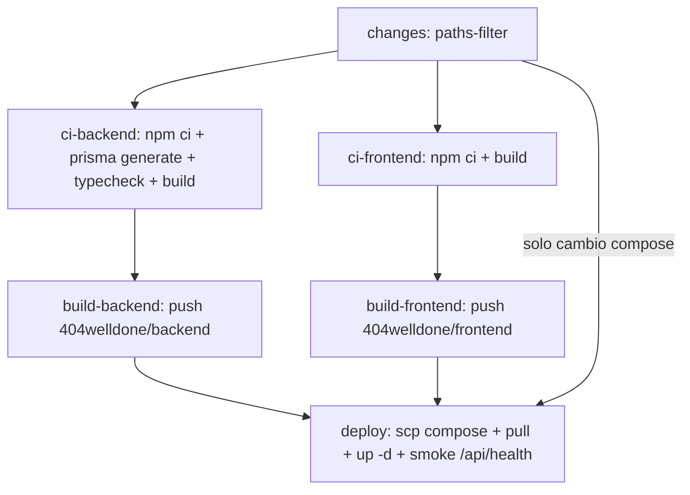

# Plan: completar el CI/CD del backend y corregir errores

Añadir el backend al pipeline de `.github/workflows/aws.yml` (filtro de cambios, gate de CI,
build/push de imagen, migraciones y despliegue) y corregir los errores que hoy impiden que el
backend compile y arranque en producción.

## Tareas

- [x] **fix-build** — `PrismaArticleRepository.ts` construye `new Article({...})` con la forma de objeto y normaliza `featuredImageUrl`/`featuredVideoUrl` nullable con `?? ''`. El typecheck pasa.
- [x] **fix-runtime** — Hacer que `dist/index.js` arranque: quitar `"type": "module"` de `backend/package.json`, poner `start` en `node dist/index.js` y `dev` en `tsx watch`, cambiar `build` a `prisma generate && tsc && tsc-alias`, añadir `tsc-alias` a `devDependencies`, mover `prisma` a `dependencies`, añadir `--passWithNoTests` al script `test`. No añadir `baseUrl`: TypeScript 6 lo marca como obsoleto (`TS5101`) y los `paths` relativos no lo necesitan. Además, sustituir el comodín `"@*"` por `"@api"` para que no colisione con paquetes npm con scope, e ignorar `dist/` en `backend/.gitignore`.
- [x] **docker-backend** — Crear `backend/.dockerignore` y `backend/Dockerfile` multi-stage con `node:24.20.0-alpine`.
- [x] **compose-prod** — Ampliar `docker-compose.prod.yml` con `postgres`, `redis`, el servicio `migrate` y `back`; añadir `API_URL=http://back:4000` al servicio `front`. Sin Maildev: `MAILDEV_HOST`/`MAILDEV_PORT` pasan a opcionales en `EnvironmentService`.
- [x] **workflow** — Actualizar `.github/workflows/aws.yml`: trigger `pull_request`, `permissions`, `concurrency`, el filtro `backend` que falta, los jobs `ci-backend`/`ci-frontend`/`build-backend`, la guarda de `deploy` y el smoke test de `/api/health`. Validado con actionlint.
- [x] **docs-env** — Actualizar `backend/.env.example` con las siete variables que valida `EnvironmentService` y documentar en `docs/deploy.md` la preparación manual de la EC2.
- [x] **verify** — `npm run build && node dist/index.js` arranca y responde en `/api/health`; `docker build ./backend` termina bien y la imagen contiene `dist/`, `bcrypt` y `@prisma/client` sin arrastrar `.env`.

## Errores confirmados (reproducidos, no hipotéticos)

1. **El workflow declara un output fantasma.** [.github/workflows/aws.yml](../.github/workflows/aws.yml) expone `backend: ${{ steps.filter.outputs.backend }}` pero el bloque `filters` solo define `frontend` y `compose`, así que ese output siempre llega vacío. No existe job `build-backend` ni `backend/Dockerfile`.
2. **`npm run build` del backend falla hoy.** `npx tsc` devuelve dos `TS2554` en [backend/src/infrastructure/article/PrismaArticleRepository.ts](../backend/src/infrastructure/article/PrismaArticleRepository.ts): llama `new Article(id, title, content)` pero `Article` recibe un único objeto `ArticleProps` (que además exige `intro`, `slug`, `status`, `featuredImageUrl`, `featuredVideoUrl`, `createdAt`, `updatedAt`).
3. **Aunque compilara, no arrancaría.** `tsc` emite CommonJS (`"module": "commonjs"`) mientras [backend/package.json](../backend/package.json) declara `"type": "module"`, así que Node interpretaría `dist/*.js` como ESM y fallaría. Y los alias no se reescriben al compilar: ejecutar el build da literalmente `Error: Cannot find module '@api'`.
4. **`"start": "tsx watch src/index.ts"`** es un script de desarrollo; no sirve como `CMD` de la imagen.
5. **No hay `backend/.dockerignore`**, así que `backend/.env` (que existe y está gitignorado) acabaría dentro de la imagen publicada en Docker Hub.
6. **`docker-compose.prod.yml` solo define `front`**, sin Postgres ni Redis, y el `EnvironmentService` valida `DATABASE_URL`, `JWT_SECRET`, `REDIS_URL` (como URL), `MAILDEV_HOST`, `MAILDEV_PORT` y `NODE_ENV` al arrancar: si falta cualquiera, el proceso muere.
7. **Las migraciones nunca se aplican.** Nada ejecuta `prisma migrate deploy`.
8. Detalles menores: no hay `concurrency` (dos pushes seguidos pueden desplegar desordenados), no hay bloque `permissions`, y el puerto SSH `2200` está escrito a mano.

## Cambios en el backend

### [backend/package.json](../backend/package.json)

- Eliminar `"type": "module"` (nos quedamos en CommonJS, según lo decidido).
- Scripts:
  - `"dev": "tsx watch src/index.ts"`
  - `"start": "node dist/index.js"`
  - `"build": "prisma generate && tsc && tsc-alias"`
  - `"test": "jest --runInBand --forceExit --passWithNoTests"` (no hay tests ni config de Jest todavía; sin `--passWithNoTests` el comando saldría con código 1).
- Mover `prisma` de `devDependencies` a `dependencies`: el contenedor necesita la CLI para `prisma migrate deploy`.
- Añadir `tsc-alias` a `devDependencies`.

### [backend/tsconfig.json](../backend/tsconfig.json)

No añadir `"baseUrl"`. TypeScript 6 lo marca como obsoleto (`TS5101`: dejará de funcionar en
TypeScript 7). Los `paths` ya empiezan por `./`, así que TypeScript 5.9 los resuelve sin `baseUrl`,
y `tsc-alias` 1.9 recalcula esas rutas respecto a `rootDir` cuando falta.

### [backend/src/infrastructure/article/PrismaArticleRepository.ts](../backend/src/infrastructure/article/PrismaArticleRepository.ts)

Pasar un objeto de props y normalizar los campos nullable de Prisma:

```ts
return new Article({
  id: firstArticle.id,
  title: firstArticle.title,
  content: firstArticle.content,
  intro: firstArticle.intro,
  slug: firstArticle.slug,
  status: firstArticle.status,
  featuredImageUrl: firstArticle.featuredImageUrl ?? '',
  featuredVideoUrl: firstArticle.featuredVideoUrl ?? '',
  createdAt: firstArticle.createdAt,
  updatedAt: firstArticle.updatedAt,
});
```

Lo mismo para el artículo de fallback, con `createdAt: new Date()` y `updatedAt: new Date()`.

### `backend/.dockerignore` (nuevo)

`node_modules`, `dist`, `.env`, `.env.*`, `.git`, `*.log`. Imprescindible antes del primer push a
Docker Hub.

### `backend/Dockerfile` (nuevo)

Multi-stage con `node:24.20.0-alpine` (verificado que existe; alinea con [.nvmrc](../.nvmrc) y
[mise.toml](../mise.toml), que piden 24.20.0 mientras el Dockerfile del front usa 24.14.1).

Dos trampas que condicionan la estructura:

- `bcrypt` es un módulo nativo y `@prisma/client` necesita `openssl` en musl, así que la etapa de build requiere `apk add --no-cache openssl python3 make g++`.
- El cliente de Prisma se genera dentro de `node_modules/.prisma`. Si la etapa final hiciera su propio `npm ci --omit=dev`, lo perdería y volvería a recompilar `bcrypt`.

Por eso: la etapa de build instala todo, genera, compila y luego hace `npm prune --omit=dev`; la
etapa final solo copia `node_modules`, `dist`, `prisma` y `package*.json`, con
`apk add --no-cache openssl`. Mismo patrón que [frontend/Dockerfile](../frontend/Dockerfile).
`EXPOSE 4000` y `CMD ["node", "dist/index.js"]`.

Si el build nativo diera problemas en musl, la alternativa es `node:24.20.0-bookworm-slim`, que trae
prebuilds de `bcrypt` y `libssl3`.

### [backend/.env.example](../backend/.env.example)

Está desactualizado (solo `DATABASE_URL_PRO` y `PORT`). Listar las siete variables que valida
`EnvironmentService`.

## [docker-compose.prod.yml](../docker-compose.prod.yml)

Añadir `back`, `postgres`, `redis` y un servicio de migración de un solo uso:

- `postgres`: `postgres:16`, volumen `postgres_data`, `healthcheck` con `pg_isready`, credenciales vía `${POSTGRES_*}` desde el `.env` que vive junto al compose en la EC2. Sin publicar puertos al host.
- `redis`: `redis:7`, `healthcheck` con `redis-cli ping`. Sin publicar puertos.
- `migrate`: misma imagen que `back`, `command: npx prisma migrate deploy`, `restart: "no"`, `depends_on: postgres: {condition: service_healthy}`. Declarativo, idempotente, y si falla el deploy se ve en el log en lugar de dejar el backend en bucle de reinicio.
- `back`: `404welldone/backend:latest`, `env_file: ./.env.back`, `ports: ['127.0.0.1:4000:4000']`, `depends_on: migrate: {condition: service_completed_successfully}`, `healthcheck` contra `/api/health`. En [backend/src/api.ts](../backend/src/api.ts) el router va montado en `/api`, así que la ruta es `/api/health` y no `/health`.
- `front`: añadir `environment: API_URL: http://back:4000` y `depends_on: back`.

Nota: `REDIS_URL` debe ser `redis://redis:6379`. Para no arrastrar Maildev a producción,
`MAILDEV_HOST`/`MAILDEV_PORT` se han hecho opcionales en `EnvironmentService` (`z.string().optional()`
y `z.coerce.number().optional()`); hoy no los consume ningún módulo, así que el cambio es seguro y el
compose de producción no define servicio `maildev` ni esas variables.

## [.github/workflows/aws.yml](../.github/workflows/aws.yml)

Añadir en la cabecera `pull_request: branches: [main]`, `permissions: contents: read` y
`concurrency: {group: deploy-${{ github.ref }}, cancel-in-progress: false}`.



Cambios concretos:

- **`changes`**: añadir el filtro que falta, para que el output `backend` deje de estar vacío.

```yaml
filters: |
  frontend:
    - 'frontend/**'
    - '.github/workflows/aws.yml'
  backend:
    - 'backend/**'
    - '.github/workflows/aws.yml'
  compose:
    - 'docker-compose.prod.yml'
```

- **`ci-backend`** (nuevo): `npm ci` en `backend/`, `npx prisma generate`, `npm run typecheck`, `npm run build`. Con `actions/setup-node@v4`, `node-version-file: .nvmrc` y `cache: npm`. Sin `lint` ni `prettier`: el backend no tiene `eslint.config.mjs` ni `.prettierrc`, así que esos scripts fallarían.
- **`ci-frontend`** (nuevo): `npm ci` y `npm run build` en `frontend/`.
- **`build-backend`** (nuevo): `needs: [changes, ci-backend]`, con `if: github.event_name == 'push' && needs.changes.outputs.backend == 'true'`. Login en Docker Hub y `docker/build-push-action@v5` con `context: ./backend`, tags `404welldone/backend:latest` y `:${{ github.sha }}`.
- **`build-frontend`**: añadir `ci-frontend` a `needs` y la condición `github.event_name == 'push'`.
- **`deploy`**: añadir `build-backend` a `needs` y a la guarda:

```yaml
needs: [changes, build-frontend, build-backend]
if: >-
  always() && !cancelled() &&
  github.event_name == 'push' &&
  needs.changes.result == 'success' &&
  needs.build-frontend.result != 'failure' &&
  needs.build-backend.result != 'failure' &&
  (needs.build-frontend.result == 'success' ||
   needs.build-backend.result == 'success' ||
   needs.changes.outputs.compose == 'true')
```

En el script SSH final, un paso de verificación tras `up -d`:

```bash
docker compose -f docker-compose.prod.yml pull
docker compose -f docker-compose.prod.yml up -d --remove-orphans
curl -fsS --retry 10 --retry-delay 3 --retry-all-errors http://127.0.0.1:4000/api/health
docker image prune -f
```

Añadir `--remove-orphans` importa porque el compose pasa de uno a cinco servicios. Y opcionalmente
mover el `port: 2200` a `${{ secrets.EC2_SSH_PORT }}` en los tres pasos.

## Preparación manual en la EC2 (una sola vez, antes del primer deploy)

Nada de esto lo puede hacer el workflow, así que conviene documentarlo en [deploy.md](deploy.md):

- Crear el repositorio `404welldone/backend` en Docker Hub.
- En `/home/ubuntu/welldone/`: `.env` con `POSTGRES_USER`/`POSTGRES_PASSWORD`/`POSTGRES_DB` (lo lee el compose) y `.env.back` con las siete variables que valida `EnvironmentService`, incluyendo `NODE_ENV=production`, `PORT=4000` y `DATABASE_URL=postgresql://<user>:<pass>@postgres:5432/<db>`.
- Añadir el bloque `location /api/ { proxy_pass http://127.0.0.1:4000; }` a la config de Nginx, **sin** barra final en `proxy_pass`. Esa barra elimina el prefijo `/api` antes de reenviar, así que una petición a `/api/health` llegaría al backend como `/health` y devolvería 404. Sin la barra, el prefijo se conserva y la app recibe `/api/health`.
- Confirmar que los secrets `DOCKERHUB_USER`, `DOCKERHUB_TOKEN`, `EC2_HOST`, `EC2_USER`, `EC2_SSH_KEY` existen en el repo.

## Verificación antes de abrir PR

`cd backend && npm ci && npm run build && node dist/index.js` (debe arrancar, no dar
`Cannot find module '@api'`), y `docker build -t welldone-back ./backend` en local.
